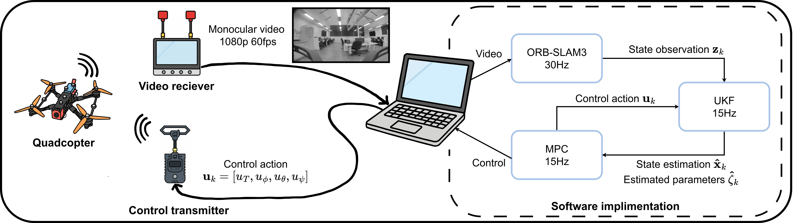

# Adaptive-Quadcopter-MPC-Using-Remote-Monocular-Vision

## Abstract

We present an adaptive control framework for quadcopter trajectory tracking using vision-only feedback. Inspired by first-person view (FPV) piloting, our system uses monocular video streamed to a remote ground station to estimate pose, identify dynamic parameters online, and compute control commands via model predictive control (MPC). The architecture integrates ORB-SLAM3 for real-time pose estimation, an augmented-state Unscented Kalman Filter (UKF) for online estimation of internal quadcopter model parameters, and an MPC controller. All control computation is performed offboard, requiring only a hobby-grade quadcopter equipped with a monocular FPV camera and standard video transmitter. Real-world experimental results demonstrate adaptation across quadcopter configurations and accurate tracking of multiple reference trajectories.

**Experiment Video:** [https://youtu.be/WppZCmhOj2w](https://youtu.be/WppZCmhOj2w)

## Simulation
Coming Soon

## Replication Guide
Coming Soon

%### Calibration
%

## Experimental Results and Plots

All plotting code used to generate figures and videos for the paper is available in [`plotting_tools/controller_angle_ukf/`](plotting_tools/controller_angle_ukf/). Experimental log files are located in `logs/ExperimentDataSets/`. Generated outputs are saved to `plotting_tools/outputs/`.

### Plotting Scripts

| Script | Description |
|--------|-------------|
| [`plot_trajectory_tracking.py`](plotting_tools/controller_angle_ukf/plot_trajectory_tracking.py) | Plots used for trajectory tracking evaluation  |
| [`plot_thrust_gain.py`](plotting_tools/controller_angle_ukf/plot_thrust_gain.py) | Plots used for throttle gain estimation  |
| [`plot_angle_offset.py`](plotting_tools/controller_angle_ukf/plot_angle_offset.py) | Plots used for flight controller offset angle estimation |
| [`generate_trajectory_tracking_videos.py`](plotting_tools/controller_angle_ukf/generate_trajectory_tracking_videos.py) | File used to generate plot for experiment video |
| [`generate_initial_video_plot.py`](plotting_tools/controller_angle_ukf/generate_initial_video_plot.py) | File used to generate plot for experiment video |
| [`calculate_time_taken.py`](plotting_tools/controller_angle_ukf/calculate_time_taken.py) | Calculate the MPC and UKF timing statistic |
| [`calculate_all_rmse.py`](plotting_tools/controller_angle_ukf/calculate_all_rmse.py) | Calculates trajectory tracking RMSE for set files |
| [`plot_general.py`](plotting_tools/controller_angle_ukf/plot_general.py) | General-purpose plotting for pose and velocity data |

