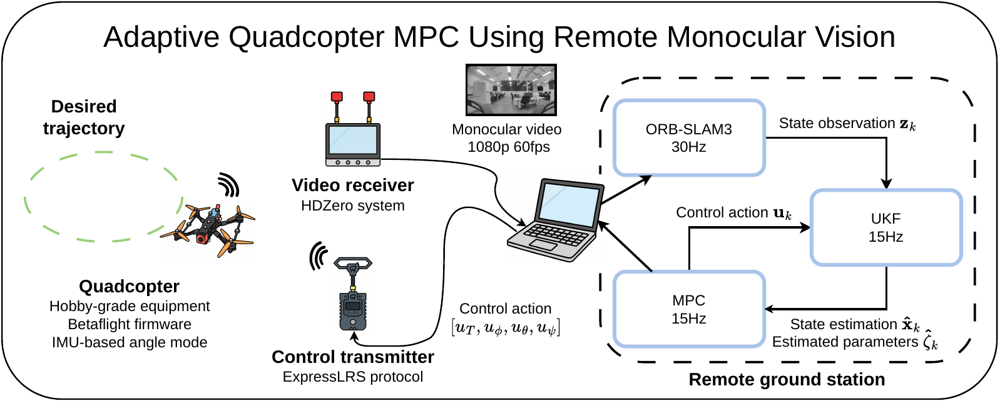

# Adaptive-Quadcopter-MPC-Using-Remote-Monocular-Vision




## Abstract

This paper presents an adaptive control framework for quadcopter trajectory tracking in which all external state feedback is derived from a monocular video stream. Inspired by first-person view (FPV) piloting, the proposed system uses monocular video streamed to a remote ground station to estimate pose, identify dynamic parameters online, and compute control commands via model predictive control (MPC), while low-level attitude stabilisation is performed by the onboard flight controller in inertial measurement unit (IMU)-based angle mode. The architecture integrates ORB-SLAM3 for real-time pose estimation, an augmented-state Unscented Kalman Filter (UKF) for online estimation of internal quadcopter model parameters, and an MPC controller. All estimation and trajectory-level control computation is performed offboard, requiring only a hobby-grade quadcopter equipped with a monocular FPV camera, video transmitter, and radio-control receiver. Real-world experimental results demonstrate adaptation across quadcopter configurations and accurate tracking of multiple reference trajectories.

**Keywords:** Adaptive model predictive control; Quadcopter; Monocular visual SLAM; UKF

**Paper:** Mitchell Torok, Mohammad Deghat, Yang Song, Jay Katupitiya, *Adaptive quadcopter model predictive control using remote monocular vision*, Control Engineering Practice, Volume 177, 2026, 107235. [https://doi.org/10.1016/j.conengprac.2026.107235](https://doi.org/10.1016/j.conengprac.2026.107235)

**Experiment Video:** [https://youtu.be/WppZCmhOj2w](https://youtu.be/WppZCmhOj2w)


## Repository Layout

| Path | Contents |
|------|----------|
| `src/controller_angle_ukf/` | MPC + augmented-state UKF controller node (the controller used in the paper) |
| `orbslam_interface/` | Our modified ORB-SLAM3 ROS 2 node (metric pose output, ArUco scale initialisation, video capture and recording), camera settings for each quadcopter, and a script that fetches the unmodified upstream [ros2_orb_slam3](https://github.com/Mechazo11/ros2_orb_slam3) package and overlays these files |
| `src/interfaces/` | Custom ROS 2 messages and services shared by all nodes |
| `src/utility_objects/` | Shared helpers: ROS callback manager, CSV data logger, RViz visualisation |
| `src/drone_communication/` | Real-world interfaces: ExpressLRS transmitter, USB video capture, motion capture receiver |
| `src/drone_visualisation/` | RViz configuration and the Arm/Takeoff panel |
| `src/simulation_communication/` | Gazebo bridge, Betaflight angle-mode emulator and motion-capture emulator |
| `simulation_assets/` | Gazebo worlds and quadcopter models (with monocular camera) |
| `logs/ExperimentDataSets/` | Real-world experiment logs used in the paper |
| `plotting_tools/` | Scripts that generate the paper figures from the logs |

## Simulation Testing

The simulation uses Gazebo Harmonic with a quadcopter model carrying a monocular camera. A Betaflight angle-mode emulator converts the controller's stick commands into motor speeds, the camera stream is bridged to `/image_raw`, ORB-SLAM3 estimates the pose from the stream alone, and a motion capture emulator publishes the Gazebo ground truth on `/motion_capture_state`. An ArUco marker in the world provides the metric scale.


### Setup

#### Install dependencies

Tested on Ubuntu 22.04 with ROS 2 Humble and Gazebo Harmonic.

1. ROS 2 Humble and Gazebo Harmonic:

   ```bash
   sudo apt install ros-humble-desktop ros-humble-ros-gzharmonic ros-humble-tf-transformations \
       ros-humble-cv-bridge ros-humble-image-transport ros-humble-image-transport-plugins python3-colcon-common-extensions
   ```

2. [acados](https://docs.acados.org/installation/) with its Python interface. Build it from source, install `acados_template`, and export the paths in your shell profile:

   ```bash
   export ACADOS_SOURCE_DIR=$HOME/acados
   export LD_LIBRARY_PATH=$ACADOS_SOURCE_DIR/lib:$LD_LIBRARY_PATH
   ```

3. ORB-SLAM3 dependencies: [Pangolin](https://github.com/stevenlovegrove/Pangolin), OpenCV 4.x with the `aruco` contrib module (`python3-opencv` / `libopencv-dev` on 22.04 include it), Eigen3 and Boost.

4. Python packages:

   ```bash
   pip install numpy scipy casadi pandas transforms3d pyserial opencv-contrib-python
   ```

#### Build the workspace

The repository is a colcon workspace. ORB-SLAM3 itself is not included; `setup_orbslam.sh` clones the upstream `ros2_orb_slam3` package (which bundles ORB-SLAM3 V1.0, its third-party libraries and the ORB vocabulary) into `src/ros2_orb_slam3`, applies a small patch, and copies our interface files over it. The vocabulary and camera settings are installed to the package share directory, so no paths need to be edited.

```bash
git clone https://github.com/Mitchell-Torok/Adaptive-Quadcopter-MPC-Using-Remote-Monocular-Vision.git
cd Adaptive-Quadcopter-MPC-Using-Remote-Monocular-Vision
./orbslam_interface/setup_orbslam.sh
source /opt/ros/humble/setup.bash
colcon build --symlink-install
source install/setup.bash
```

The MPC solver is generated by acados the first time the controller runs (about 3 s) and is cached in `c_generated_code/`. Every terminal used below needs `source install/setup.bash` and `ACADOS_SOURCE_DIR` set.
#### Launch the simulation

Run each command in its own terminal, after sourcing `install/setup.bash` in each:

```bash
# Terminal 1: Gazebo world (must be launched from simulation_assets so the model files resolve)
cd simulation_assets && gz sim -v -r world_drone_env.sdf

# Terminal 2: Gazebo <-> ROS 2 bridges, Betaflight emulator, motion capture emulator and camera republisher
ros2 launch simulation_communication betaflight_angle_simulation_launch.py

# Terminal 3: ORB-SLAM3 (defaults to the simulation camera settings)
ros2 run ros2_orb_slam3 mono_node_cpp

# Terminal 4: RViz with the Arm / Takeoff panel
ros2 launch drone_visualisation view_frame.launch.py
```

Leave all four running. Each flight is started by pressing **Arm** then **Takeoff** in the RViz panel once the controller is running.

### Calibration

Monocular ORB-SLAM3 has no map and no metric scale when it starts, so a flight cannot begin on ORB-SLAM3 alone. Before the first ORB-SLAM3 flight the SLAM node needs one **calibration flight** during which it builds its map and locks the metric scale from the ArUco marker. The easiest way to do this in simulation is to fly the calibration flight on the exact Gazebo position from the motion capture emulator, then switch the controller to ORB-SLAM3. The `use_motion_capture` parameter selects the pose source for a whole flight (`true`: `/motion_capture_state`; `false`, the default: `/orb_slam_state`), so no source edit is needed:

```bash
# Terminal 5: calibration flight on the exact simulated position
ros2 run controller_angle_ukf main --ros-args -p use_motion_capture:=true
```

Press **Arm** then **Takeoff** in the RViz panel. The controller flies the selected trajectory, lands, disarms and exits on its own (about 75 s). During the flight the SLAM terminal prints `Have N/16 reference points` while it collects marker observations and `Updated scale: ...` once the scale is locked. Check that this line has appeared before moving on. The SLAM node must then be left running: restarting it discards the map and the scale, and the calibration flight has to be repeated.

### Running

With the calibrated SLAM node still running, every subsequent flight is flown on ORB-SLAM3 alone:

```bash
# Terminal 5: ORB-SLAM3 flight
ros2 run controller_angle_ukf main
```

Press **Arm** then **Takeoff** in the RViz panel as before. The controller now takes its pose from `/orb_slam_state` for control and the UKF update; the motion capture pose is still logged alongside it for comparison.

## Real World Testing

Hardware used in the paper:

- A Betaflight quadcopter in **angle mode** with an HDZero digital FPV camera and video transmitter (only HDZero has been tested; analogue video has not)
- An ExpressLRS transmitter module connected to the ground station over USB (`/dev/ttyUSB*`, 921600 baud)
- A USB video capture device receiving the FPV video stream
- The ArUco marker (OpenCV `DICT_5X5_50`, id 0) printed with a known black-square side length, placed in view of the camera; the same marker is used in the simulation world (`simulation_assets/5x5_1000-0`)
- Optionally, a motion capture system for ground truth (a UDP receiver is provided in `motion_capture_publisher_node`)

The hardware used is described in the paper. A wiring guide for the ExpressLRS transmitter module and ground station link is not written up here, as the system is still being improved. If you are replicating that part of the setup, please open an issue or contact the first author and we will be happy to share the details.

### Setup

Build the workspace as described in the simulation setup, then run each command in its own terminal after sourcing `install/setup.bash`. Camera settings for the four quadcopters used in the paper are in `orbslam_interface/config/Monocular/` (`tinywhoop_HDZero.yaml`, `tinytrainer_HDZero.yaml`, `cinewhoop_HDZero.yaml`, `freestyle_HDZero.yaml`).

```bash
# Terminal 1: ExpressLRS link to the quadcopter
ros2 run drone_communication elrs_interface

# Terminal 2 (optional): motion capture ground truth
ros2 run drone_communication motion_capture_publisher_node

# Terminal 3: ORB-SLAM3 on the FPV video capture device
ros2 run ros2_orb_slam3 mono_node_cpp --ros-args \
    -p input_mode:=v4l2 -p device:=/dev/video0 -p width:=1280 -p height:=720 -p fps:=60 \
    -p settings_file_path_arg:=$(ros2 pkg prefix ros2_orb_slam3)/share/ros2_orb_slam3/orb_slam3/config/Monocular/tinytrainer_HDZero.yaml \
    -p marker_size:=0.15 -p uptilt_deg:=20.0

# Terminal 4: RViz with the Arm / Takeoff panel
ros2 launch drone_visualisation view_frame.launch.py
```

Leave all four running. Each flight is started by pressing **Arm** then **Takeoff** in the RViz panel once the controller is running.

`marker_size` is the printed marker's black-square side length in metres, `uptilt_deg` is the camera tilt of the airframe, and `camera_offset_x`/`camera_offset_z` are the camera position relative to the centre of mass.

### Calibration

#### Camera calibration

Camera intrinsics for a new quadcopter are obtained with the standard OpenCV chessboard calibration and entered into a new settings yaml in `orbslam_interface/config/Monocular/`; `orbslam_interface/scripts/test_aruco.py` can be used to verify a calibration file against the marker before flying.


#### ORB-SLAM3 calibration

As in simulation, ORB-SLAM3 needs to build its map and lock the metric scale before the controller can fly on it. In the real world this is done by hand, as shown in the calibration video above: with the SLAM node running and the quadcopter powered on, hold it and slide it slowly by hand about 1 m forward and back, up and down, and left and right in front of the ArUco marker, and repeat the sequence twice. The SLAM terminal prints `Have N/16 reference points` as the marker observations are collected and `Updated scale: ...` once the scale is locked. Then place the quadcopter at its take-off position and leave the SLAM node running; restarting it discards the map and the scale.

### Testing

With the calibrated SLAM node still running:

```bash
# Terminal 5: controller on ORB-SLAM3
ros2 run controller_angle_ukf main
```

Press **Arm** then **Takeoff** in the RViz panel. The controller flies the selected trajectory, lands and disarms on its own. Logs are written to `logs/controller_angle_ukf/<trajectory>_<timestamp>/log.csv` as in simulation; when the motion capture publisher is running its pose is logged alongside the ORB-SLAM3 pose for evaluation.

## Plotting Scripts

All plotting code used to generate figures and videos for the paper is available in [`plotting_tools/controller_angle_ukf/`](plotting_tools/controller_angle_ukf/). Experimental log files are located in `logs/ExperimentDataSets/`. Generated outputs are saved to `plotting_tools/outputs/`.

| Script | Description |
|--------|-------------|
| [`plot_trajectory_tracking.py`](plotting_tools/controller_angle_ukf/plot_trajectory_tracking.py) | Plots used for trajectory tracking evaluation  |
| [`plot_thrust_gain.py`](plotting_tools/controller_angle_ukf/plot_thrust_gain.py) | Plots used for throttle gain estimation  |
| [`plot_angle_offset.py`](plotting_tools/controller_angle_ukf/plot_angle_offset.py) | Plots used for flight controller offset angle estimation |
| [`generate_trajectory_tracking_videos.py`](plotting_tools/controller_angle_ukf/generate_trajectory_tracking_videos.py) | File used to generate plot for experiment video |
| [`generate_initial_video_plot.py`](plotting_tools/controller_angle_ukf/generate_initial_video_plot.py) | File used to generate plot for experiment video |
| [`calculate_time_taken.py`](plotting_tools/controller_angle_ukf/calculate_time_taken.py) | Calculate the MPC and UKF timing statistic |
| [`calculate_all_rmse.py`](plotting_tools/controller_angle_ukf/calculate_all_rmse.py) | Calculates trajectory tracking RMSE for set files |
| [`plot_general.py`](plotting_tools/controller_angle_ukf/plot_general.py) | General-purpose plotting for pose and velocity data |

## Citation

If you use this code, please cite the paper:

> Mitchell Torok, Mohammad Deghat, Yang Song, Jay Katupitiya, Adaptive quadcopter model predictive control using remote monocular vision, Control Engineering Practice, Volume 177, 2026, 107235, ISSN 0967-0661, https://doi.org/10.1016/j.conengprac.2026.107235. (https://www.sciencedirect.com/science/article/pii/S0967066126004788)

```bibtex
@article{torok2026adaptive,
  title   = {Adaptive quadcopter model predictive control using remote monocular vision},
  author  = {Torok, Mitchell and Deghat, Mohammad and Song, Yang and Katupitiya, Jay},
  journal = {Control Engineering Practice},
  volume  = {177},
  pages   = {107235},
  year    = {2026},
  issn    = {0967-0661},
  doi     = {10.1016/j.conengprac.2026.107235},
  url     = {https://www.sciencedirect.com/science/article/pii/S0967066126004788}
}
```

## License

This repository is released under the GPL-3.0 license (see `LICENSE`). `orbslam_interface/` is derived from [ORB-SLAM3](https://github.com/UZ-SLAMLab/ORB_SLAM3) and [ros2_orb_slam3](https://github.com/Mechazo11/ros2_orb_slam3), which are also GPL-3.0.

## Disclaimer

The controller, estimator, simulation and ORB-SLAM3 interface code in this repository was written by hand by the authors for the paper. The public code release (repository clean-up, build scripts and packaging) and this README were generated with the assistance of Claude (Anthropic).
